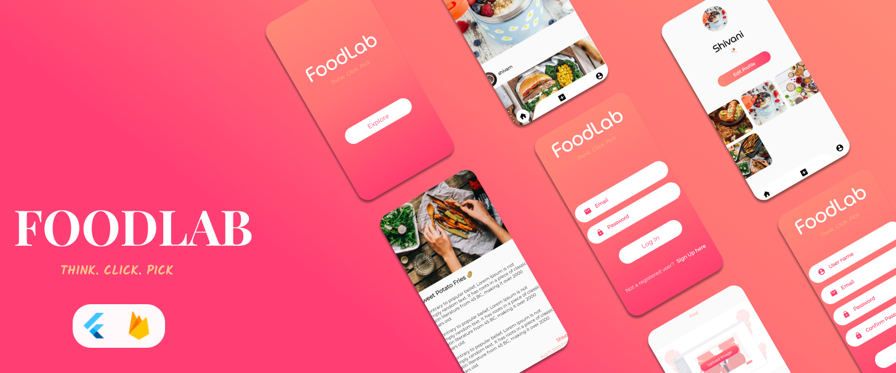

  

 
<i>A Food App using <a href="https://flutter.dev/">Flutter 💕</a> & <a href="https://firebase.google.com/">Firebase 🔥</a>  </i>
  
  
## About App 🥘

  - FoodLab is a App to post and view food blogs along with their recipes if you want 🤤!
  
  - Login or SignUp using any account(Your credentials are safe) 🤩 and this will lead you to the feed page.
  
  - You can also build your own profile 😎 and you'll see others people's blogs in your feed, you can also see the detail steps to make a dish if the owner has         written it's recipe 😍.
  
  - All the data is stored in Firebase🔥 because of real-time database you'll get the latest and yummy food blogs 🍔.
  
  - Post your amazing mouth watering dishes 🤤 with cool pictures 😍 and make sure you write detail steps of the recipe 📝 so that I and others can also try and         enjoy 🤗.
  
## Mockups 😍

     
 

  
