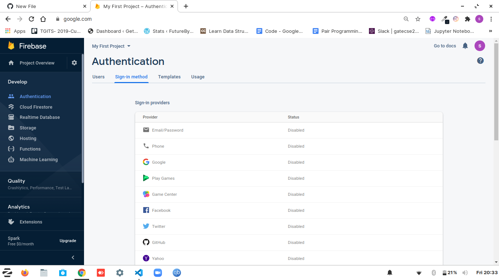
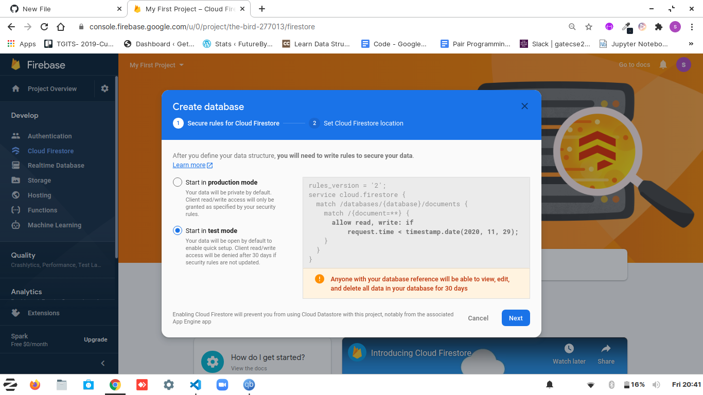
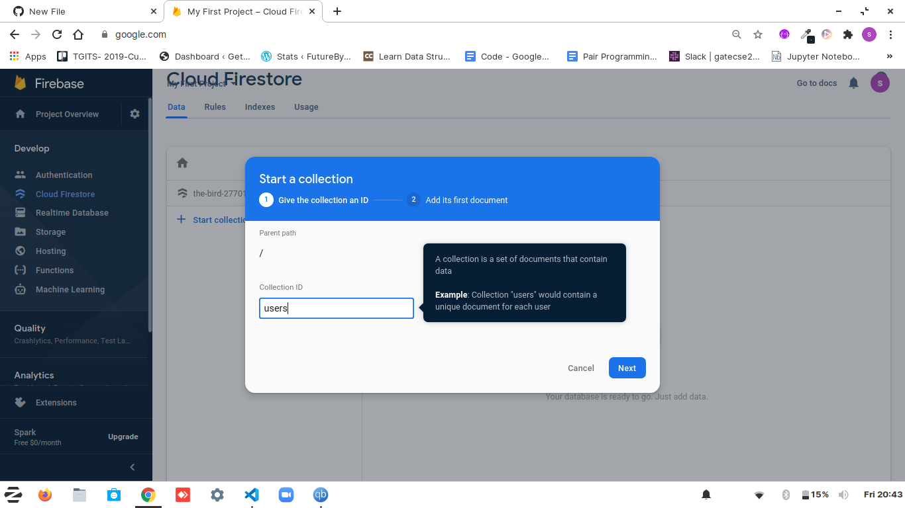
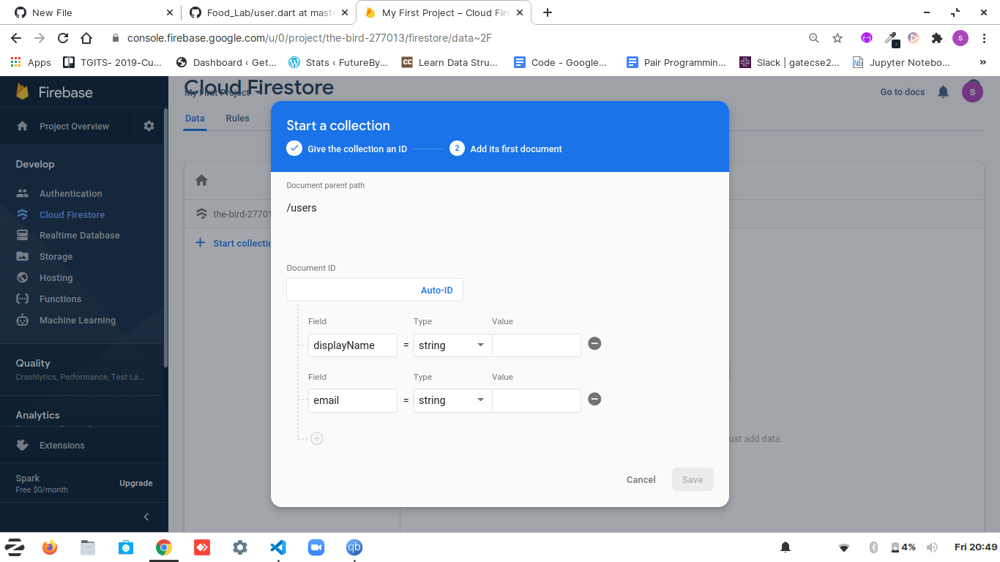
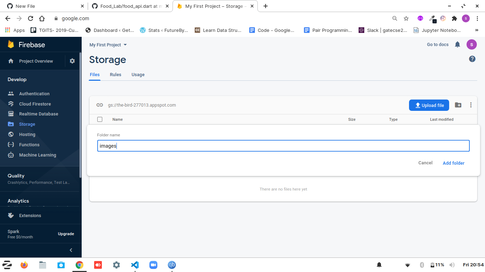

# NEW UPDATE
## 1. For the security purpose, Access to Firebase Realtime Database has been closed. 

If anyone wants to do some changes or wants to see the working of the app, one has to do following things to build their own database - 

1. Create an account on Firebase - https://firebase.google.com/
2. Click on 'GO TO CONSOLE' on top right corner.
3. Create a new Project (Follow some youtube or any tutorial if you are doing first time or follow along with instructions given by Google). After all the steps,
4. Add your json file into the project(that you've downloaded or forked).
5. After creating the project successfully you'll find the page look like this- 
#### Here are only three things you have to change or create for the whole project to run on your system i.e. Login/Sign-up Method, Cloud Firestore and Storage.

6. For Login/Sign-up, go to 'Authentication' and enable sign-in methods. The two I have used are - Email/Password, Anonymous.

7. For Cloud Firestore, go to 'Cloud Firestore' and click on 'Create Database', you'll the screen looks like this - 

8. Click on any of the option you prefer. Click on 'Next'. Choose any location. Click on 'Enable'.

9. If you'll read all the db files properly you'll find the name of collections I have used in 'my' Firebase Database are 'foods' and 'users'.

10. Click on 'Start Collection' and named it 'users', see the "lib/model/user.dart" to see all the attributes of "users" collection. Write the first document for your testing purpose like this - 

11. Do the same for "foods" Collection, repeat step 10.

12. For Storage(to store user profile and food blog's images), Go to "STORAGE". Click on create folder icon on right, create a folder of name "images" -

13. And it's done! Run your project. Although all the things are set, see if you counter any errors, if so feel free to drop me a message on - shivanisingh260500@gmail.com

14. Enjoye!!
